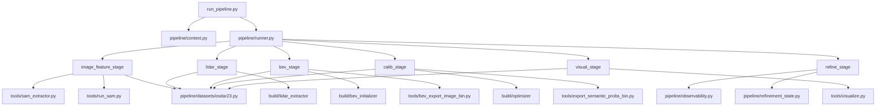

# EdgeCalib v2.0 OsDaR23 专项分析报告

> 生成日期：2026-04-20  
> 分析范围：KITTI 清理后的代码检查 + `result_osdar23` 执行效果分析

---

## 一、修改后的代码检查：仍存在的问题

### A. 遗留 KITTI 引用（文案/注释层面）

| 文件 | 行号 | 问题描述 |
|------|------|----------|
| `pipeline/datasets/resolver.py` | L4–7 | 模块文档仍写 "KITTI vs OSDaR23" 及 KITTI 文件名格式描述 |
| `configs/osdar23.yaml` | L21 | `velo_to_cam_file: ""` 是 KITTI 时代遗留字段，`OSDaR23Adapter` 完全未使用，应删除 |
| `configs/osdar23.yaml` | L23 | 注释含 "独立于 KITTI 的 result/" 字样 |
| `pipeline/datasets/base.py` | 全文 | 文档字符串仍写 "KITTI vs OSDaR23"（不影响运行） |

---

### B. 逻辑/一致性问题

#### B1：`visual_stage.py` 中 `image_sensor` 默认值不一致（中等风险）

`pipeline/stages/visual_stage.py` 第 24 行：

```python
img_sensor = str(context.config.get("data", {}).get("image_sensor", "") or "")
```

`image_sensor` 默认为空字符串 `""`，而 `calib_stage.py`、`osdar23.py`、`run_sam.py` 等全部默认 `"rgb_center"`。

**影响**：当配置中未显式写 `image_sensor` 时，`visual_stage.py` 不传 `--image_sensor` 参数给 `visualize.py`，后者从图像路径推断相机，可能与标定/内参读取所用相机不一致，导致可视化投影错误。

**修复建议**：将默认值改为 `"rgb_center"`：
```python
img_sensor = str(context.config.get("data", {}).get("image_sensor", "rgb_center") or "rgb_center")
```

---

#### B2：`tools/run_sam.py` BEV 参数硬编码，与配置不一致（重要）

`tools/run_sam.py` 第 171–175 行（`--semantic_bundle` 分支）：

```python
bev_cfg = {
    "x_range": [0.0, 80.0],
    "y_range": [-20.0, 20.0],
    "resolution": 0.1,
}
```

而 `configs/osdar23.yaml` 配置为：

```yaml
bev:
  x_range: [0.0, 100.0]
  y_range: [-25.0, 25.0]
  resolution: 0.05
```

LiDAR BEV 实测元数据（`result_osdar23/lidar_features/0000000012_bev_meta.json`）：
```json
{"nx":500,"ny":250,"xmin":0,"ymin":-25,"resolution":0.2}
```

**三者网格规格对比**：

| 来源 | x 范围 | y 范围 | 分辨率 | 网格大小 |
|------|--------|--------|--------|----------|
| `run_sam.py`（硬编码） | 0–80 m | ±20 m | 0.1 m | 800×400 |
| `osdar23.yaml`（配置） | 0–100 m | ±25 m | 0.05 m | 2000×1000 |
| LiDAR C++ 输出（实测） | 0–100 m | ±25 m | 0.2 m | 500×250 |

三者完全不一致，导致 BEV 对齐系统性失效。

**修复建议**：删除 `run_sam.py` 内的硬编码 `bev_cfg`，改为从命令行参数读取（`--bev_x_range`、`--bev_resolution` 等），由 `image_feature_stage.py` 调用时传入 `osdar23.yaml` 中的配置值。

---

#### B3：`bev_stage.py` 无条件应用近零置信度的 BEV delta（重要）

`pipeline/stages/bev_stage.py` 第 139–143 行：无论 `rail_score` 多小，只要 `pose_after_bev.txt` 存在就写入 `context.bev_pose_by_frame` 并作为 `calib_stage` 的初始值。

**实测数据**：
```json
{"rail_score": 0.000757946, "yaw_rad": 0.0872665, "tx_m": -2, "ty_m": 1}
```

`rail_score ≈ 7.6e-4 ≈ 0`，但仍应用了 `tx = -2 m`、`ty = +1 m`、`yaw = 5°` 的大幅修正，导致：
- `init_pose.txt`：`tvec = [-0.28, 3.49, 0.30]`
- `pose_after_bev.txt`：`tvec = [-2.28, 4.49, 0.30]`

后续标定从错误的起点出发。

**修复建议**：增加最低置信度门槛（如 `min_rail_score_for_bev_apply: 0.01`），低于门槛时放弃 BEV delta，保留原 `init_pose`，并打印警告日志。

---

#### B4：`pipeline/observability.py` 对同一文件重复加载（性能）

第 107 行和第 112 行对 `semantic_probs.npy` 做了两次 `np.load`：

```python
# L107
mm = _safe_mean_max_prob(npy_sem)  # 内部 np.load 一次

# L112
z = np.load(npy_sem)  # 又 np.load 一次
```

**修复建议**：合并为一次加载，复用 `z` 数组。

---

## 二、程序执行效果不佳的根本原因分析

### 关键证据：`rail_term_norm: -1639.34` 是哨兵值而非真实得分

**C++ 源码**（`cpp/optimizer_scoring.cpp` L229–231）：

```cpp
if (visible_count < 50) return -1e5 + visible_count;
return total_score;
```

**逻辑推算**：

```
rail_score_norm = raw / N_rail
```

若 `raw = -1e5 + k`，且 N_rail（LiDAR 轨道点数）约 61，则：

```
rail_score_norm ≈ (-100000 + 61) / 61 ≈ -1639.3
```

**与实测结果完全吻合（-1639.34）**。这意味着：**在当前外参下，LiDAR 轨道点投影到图像内的可见点数不足 50 个，`EdgeAttractionScore` 返回哨兵负值，而非真实的吸引场得分**。`w_rail = 1.2` 乘以此哨兵值，主导并拉崩总分（`Score: -1967.55`）。

---

### 根本原因链（按优先级排序）

#### P1（最关键）：初始外参导致 LiDAR 轨道点无法充分投影入图

```
init_pose.txt:      rvec=[1.29, -1.28, 1.15],  tvec=[-0.28, 3.49, 0.30]
pose_after_bev.txt: rvec=[1.35, -1.23, 1.21],  tvec=[-2.28, 4.49, 0.30]
calib 输出:         rvec=[1.27, -1.15, 1.29],  tvec=[-2.41, 4.44, 0.48]
```

BEV 粗初始化基于近零 `rail_score` 将 `tx` 大幅偏移了 2m，两个初始位置都可能将 LiDAR 轨道点推出相机视野，触发哨兵值，整个标定过程在错误盆地内徘徊。

#### P2：BEV 粗初始化没有最低置信度门槛

如"B3"所述，`bev_stage.py` 在 `rail_score ≈ 0` 的情况下仍无条件写入并使用粗估位姿，引入 2m 级别噪声。

#### P3：`run_sam.py` 硬编码 BEV 参数与管线不一致

如"B2"所述，图像侧 pseudo-BEV 与 LiDAR 侧 BEV 网格分辨率和覆盖范围完全不对齐，BEV 粗搜索基于错误的对齐基础，即使逻辑正确也无法找到有效对准。

#### P4：轨道中心线仅覆盖图像最底部，`rail_dist` 吸引场极窄

从 `result_osdar23/sam_features/0000000012_rail_centerlines_2d.txt` 可见：

```
0 335 758
0 342 758
...（所有点 v≈758–761，图像最底部约 3–4 行）
```

对应 C++ 逻辑：`GetDistanceValue` 在远离这些行的区域给出接近 1.0 的距离值，`(1 - dist) * edge_weight ≈ 0`，大量投影点被 `edge_weight ≤ 1e-4` 条件跳过，可见点数降至 50 以下。

**根本原因**：`configs/osdar23.yaml` 中 `rail_top_ignore_ratio: 0.18` 和 `rail_bottom_keep_ratio: 0.78` 的设置，在长直铁路的强透视下**系统性地将远处轨道（对应图像中上部）排除在外**，导致只检测到近处极底部的轨道像素。

#### P5：`semantic_calib` 权重设置可能放大噪声

`osdar23.yaml` 中 `class_weights.rail: 4.0`、`rail_weight: 1.2`，在 `rail_term_norm` 已经是哨兵负值的情况下，较高的权重进一步放大了这个错误信号对总分的负面影响。

#### P6：单帧精修无法体现时间一致性

```json
"window_frame_ids": [12],
"params": {"window_size": 5, ...}
```

仅处理了 1 帧，窗口大小 5 无意义，`refined_*` 与 `calib` 输出完全相同，精修阶段形同虚设。这是配置层面问题（`frame_ids: [12]` 只选了单帧），需要在多帧场景下才能发挥精修的作用。

---

## 三、建议修改内容（按优先级）

### 高优先级（影响运行正确性）

| 编号 | 文件 | 修改内容 |
|------|------|----------|
| H1 | `pipeline/stages/bev_stage.py` | 增加 `rail_score` 最低门槛配置项 `bev.min_rail_score_to_apply`（建议默认 `0.01`），低于门槛时拒绝应用 BEV delta，保留原始 `init_pose` |
| H2 | `tools/run_sam.py` | 删除硬编码 `bev_cfg`，改为命令行参数 `--bev_x_range`、`--bev_y_range`、`--bev_resolution`；`image_feature_stage.py` 传入 config 中的值 |
| H3 | `pipeline/stages/visual_stage.py` | `image_sensor` 默认值改为 `"rgb_center"` |

### 中优先级（提升结果质量）

| 编号 | 文件 | 修改内容 |
|------|------|----------|
| M1 | `configs/osdar23.yaml` | 调整 `rail_top_ignore_ratio`（从 0.18 降低至 0.05 左右）以覆盖透视下远处轨道；或完全去掉上方截断，改为在全图搜索 |
| M2 | `configs/osdar23.yaml` | 删除 `velo_to_cam_file: ""` 遗留字段 |
| M3 | `pipeline/observability.py` | 合并两次 `np.load`，只加载一次 `semantic_probs.npy` |
| M4 | `configs/osdar23.yaml` | 在 `bev` 段增加 `min_rail_score_to_apply: 0.01` 配置项 |

### 低优先级（文案清理）

| 编号 | 文件 | 修改内容 |
|------|------|----------|
| L1 | `pipeline/datasets/resolver.py` | 更新模块文档字符串，去掉 KITTI 文件名说明 |
| L2 | `pipeline/datasets/base.py` | 更新文档字符串 |
| L3 | `configs/osdar23.yaml` | 去掉注释中的 KITTI 字样 |

---

## 四、调用关系总览（修改后）



---

## 五、外参约定一致性核查（C++ 与 Python）

| 环节 | 约定 | 一致性 |
|------|------|--------|
| C++ optimizer（`optimizer_scoring.cpp`） | `p_cam = R * p_lidar + t`（LiDAR→Camera） | 是 |
| Python `osdar23.py` `load_osdar23_init_extrinsic` | `T = T_body_to_optical @ inv(T_cam_to_parent)`，拆为 `rvec, tvec` | 是 |
| C++ `io_utils.cpp` `LoadOSDaRCalib` | 同上：`T_lidar_to_cam = T_body_to_optical * T_lidar_to_body` | 是 |
| `LoadCalib` OsDaR 分支 | `R_rect = I`，`P_rect = [K\|0]` | 是 |
| Python `load_osdar23_intrinsics` | `R_rect = I`，`P_rect = [K\|0]` | 是 |

外参与内参约定在 Python 和 C++ 两侧**完全一致**，排除了坐标系不一致导致投影失败的可能性。效果不佳的根本原因在于**初始外参质量和轨道检测覆盖范围**，而非坐标系问题。

---

*报告结束*
